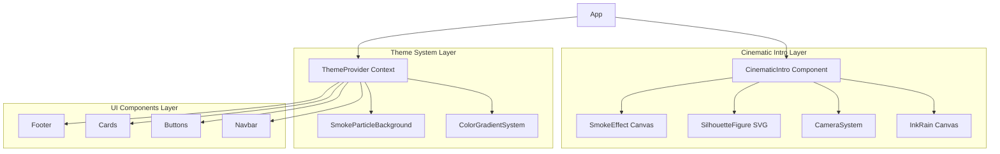

# Design Document: Cinematic Intro UI

## Overview

本设计文档描述了一个电影级开场动画系统和日间主题UI的技术实现方案。系统分为两个主要部分：

1. **Cinematic Intro System** - 包含墨色雨水、视角过渡、人物剪影、烟雾效果的开场动画
2. **Dynamic Theme System** - 包含12+颜色渐变、烟雾粒子背景、主题化UI组件的日间主题

技术栈基于现有项目：React + TypeScript + Framer Motion + Tailwind CSS + Canvas API

## Architecture



## Components and Interfaces

### 1. CinematicIntro Component

主开场动画容器组件，协调所有动画阶段。目标帧率120Hz，粒子数量最大化以实现最细腻的视觉效果。

```typescript
interface CinematicIntroProps {
  onComplete: () => void;
  duration?: number; // 默认 10000ms (增加3秒墨色雨水时间)
  targetFPS?: number; // 默认 120
}

interface IntroPhase {
  phase: 'ink-rain' | 'camera-rise' | 'silhouette-smoke' | 'smoke-inhale' | 'smoke-exhale' | 'smoke-zoom' | 'smoke-disperse' | 'transition';
  startTime: number;
  duration: number;
}

// 动画阶段时间线 (总计约10秒)
const INTRO_TIMELINE: IntroPhase[] = [
  { phase: 'ink-rain', startTime: 0, duration: 4500 },        // 墨色雨水持续4.5秒
  { phase: 'camera-rise', startTime: 500, duration: 4000 },   // 视角上升4秒
  { phase: 'silhouette-smoke', startTime: 4000, duration: 1500 }, // 人物出现+吸烟
  { phase: 'smoke-inhale', startTime: 4500, duration: 800 },  // 吸烟动作
  { phase: 'smoke-exhale', startTime: 5300, duration: 1500 }, // 呼出烟雾
  { phase: 'smoke-zoom', startTime: 6500, duration: 1500 },   // 视角拉近烟雾
  { phase: 'smoke-disperse', startTime: 8000, duration: 1000 }, // 烟雾从中间散开
  { phase: 'transition', startTime: 9000, duration: 1000 }    // 模糊到清晰过渡
];

// 性能配置
const PERFORMANCE_CONFIG = {
  targetFPS: 120,
  maxRaindrops: 300,      // 最大雨滴数量
  maxSmokeParticles: 500, // 最大烟雾粒子
  maxSplashParticles: 100, // 最大溅射粒子
  enableReflection: true,  // 启用地面镜像
  enableMouseInteraction: true // 启用鼠标交互
};
```

### 2. InkRain Canvas Component

墨色雨水效果，使用Canvas 2D渲染，包含地面镜像反射和溅射效果。

```typescript
interface RainDrop {
  x: number;
  y: number;
  length: number;       // 雨滴长度 (10-40px)
  speed: number;        // 下落速度 (8-20px/frame)
  opacity: number;      // 透明度 (0.3-0.9)
  thickness: number;    // 粗细 (1-3px)
  angle: number;        // 倾斜角度 (微小随机)
}

interface Splash {
  x: number;
  y: number;
  radius: number;
  opacity: number;
  particles: SplashParticle[];
  ripples: Ripple[];    // 水波纹效果
}

interface SplashParticle {
  x: number;
  y: number;
  vx: number;           // 水平速度 (随机方向)
  vy: number;           // 垂直速度 (向上弹起)
  size: number;         // 粒子大小 (1-4px)
  opacity: number;
  life: number;
  gravity: number;      // 重力影响
}

interface Ripple {
  x: number;
  y: number;
  radius: number;
  maxRadius: number;
  opacity: number;
  speed: number;        // 扩散速度
}

interface ReflectionConfig {
  enabled: boolean;
  groundY: number;      // 地面Y坐标
  reflectionHeight: number; // 反射区域高度
  opacity: number;      // 反射透明度 (0.3-0.5)
  blur: number;         // 反射模糊程度
  distortion: number;   // 水波扭曲程度
}

interface InkRainProps {
  isActive: boolean;
  intensity: number;    // 0-1, 控制雨滴密度
  groundLevel: number;  // 地面Y坐标百分比 (默认85%)
  reflection: ReflectionConfig;
  maxDrops?: number;    // 默认300
}

// 雨滴生成配置
const RAINDROP_CONFIG = {
  minLength: 10,
  maxLength: 40,
  minSpeed: 8,
  maxSpeed: 20,
  minOpacity: 0.3,
  maxOpacity: 0.9,
  minThickness: 1,
  maxThickness: 3,
  angleVariation: 0.1,  // 倾斜角度变化范围
  colors: ['#1a1a1a', '#2d2d2d', '#404040', '#595959', '#737373'] // 墨色渐变
};

// 溅射效果配置
const SPLASH_CONFIG = {
  particleCount: 8,     // 每次溅射的粒子数
  particleSpeed: 3,     // 粒子初始速度
  particleLife: 30,     // 粒子生命周期(帧)
  rippleCount: 2,       // 水波纹数量
  rippleSpeed: 2,       // 波纹扩散速度
  rippleMaxRadius: 30   // 波纹最大半径
};
```

### 3. CameraSystem

视角控制系统，使用CSS transform和Framer Motion。

```typescript
interface CameraState {
  y: number; // 垂直位置 (0 = 地底, 100 = 平视)
  scale: number; // 缩放级别
  blur: number; // 模糊程度
}

interface CameraSystemProps {
  phase: IntroPhase['phase'];
  onPhaseComplete: (phase: string) => void;
}

// 视角关键帧
const CAMERA_KEYFRAMES = {
  ground: { y: 0, scale: 1.2, blur: 2 },
  rising: { y: 50, scale: 1.1, blur: 1 },
  eyeLevel: { y: 100, scale: 1, blur: 0 },
  smokeZoom: { y: 100, scale: 2, blur: 0 }
};
```

### 4. SilhouetteFigure Component

背光人物剪影，使用SVG和CSS滤镜。男性侧脸轮廓，忧郁气质，叼着香烟。

```typescript
interface SilhouetteFigureProps {
  isVisible: boolean;
  glowIntensity: number;    // 背光强度 0-1
  smokingPhase: 'idle' | 'inhale' | 'exhale'; // 吸烟动作阶段
  cigaretteGlowIntensity: number; // 烟头发光强度
}

// 人物剪影设计说明
const SILHOUETTE_DESIGN = {
  pose: 'side-profile',     // 侧脸轮廓
  gender: 'male',
  mood: 'melancholic',      // 忧郁气质
  features: {
    hair: 'slightly-messy', // 微乱的头发
    jawline: 'defined',     // 清晰的下颌线
    nose: 'profile-visible', // 侧面鼻子轮廓
    cigarette: {
      position: 'mouth-corner', // 嘴角叼烟
      angle: 15,            // 微微上翘角度
      glowColor: '#ff6b35', // 烟头发光颜色
      glowRadius: 8         // 发光半径
    }
  },
  backlight: {
    color: '#ffffff',
    blur: 20,
    spread: 10,
    opacity: 0.6
  }
};

// SVG路径定义 - 男性侧脸轮廓
// 包含：头发轮廓、额头、眉骨、鼻子、嘴唇、下巴、脖子、肩膀、香烟
// 不显示正脸，只有侧面剪影

interface SmokingAnimation {
  inhaleScale: number;      // 吸气时胸部微微扩张
  exhaleDelay: number;      // 呼气延迟
  cigaretteGlowPulse: boolean; // 吸气时烟头变亮
}
```

### 5. SmokeEffect Canvas Component

烟雾粒子效果，使用Canvas 2D和粒子系统。支持鼠标交互，烟雾从呼出到充满屏幕再从中间散开的完整动画。

```typescript
interface SmokeParticle {
  x: number;
  y: number;
  vx: number;
  vy: number;
  size: number;           // 粒子大小 (5-50px)
  opacity: number;        // 透明度 (0.1-0.8)
  rotation: number;       // 旋转角度
  rotationSpeed: number;  // 旋转速度
  life: number;
  maxLife: number;
  turbulence: number;     // 湍流强度
  noiseOffset: number;    // Perlin噪声偏移
}

interface SmokeEffectProps {
  emitterPosition: { x: number; y: number };
  isActive: boolean;
  phase: 'exhale' | 'float' | 'zoom' | 'disperse'; // 烟雾阶段
  density: number;        // 烟雾密度 (粒子生成速率)
  spreadFactor: number;   // 扩散系数
  focusLevel: number;     // 0 = 模糊, 1 = 清晰
  mousePosition: { x: number; y: number } | null; // 鼠标位置用于交互
}

// 烟雾形状配置 - 模拟真实呼出烟雾
const SMOKE_SHAPE_CONFIG = {
  exhale: {
    // 呼出时的烟雾形状 - 从嘴部喷出的锥形
    initialVelocity: { x: 3, y: -2 },
    spread: 0.3,
    particleSize: { min: 5, max: 15 },
    emissionRate: 20,     // 每帧生成粒子数
  },
  float: {
    // 漂浮时的烟雾 - 自然上升扩散
    velocityDecay: 0.98,
    turbulenceStrength: 0.5,
    sizeGrowth: 1.02,     // 粒子逐渐变大
    opacityDecay: 0.995,
  },
  zoom: {
    // 视角拉近时 - 烟雾充满屏幕
    targetScale: 3,
    blurIncrease: true,
    particleSizeMultiplier: 2,
  },
  disperse: {
    // 从中间散开 - 露出网页
    disperseCenter: { x: 0.5, y: 0.5 }, // 屏幕中心
    disperseForce: 5,     // 散开力度
    disperseRadius: 0,    // 从0开始扩大
    maxDisperseRadius: 1.5, // 最大散开半径(屏幕倍数)
  }
};

// 鼠标交互配置
const MOUSE_INTERACTION_CONFIG = {
  enabled: true,
  influenceRadius: 100,   // 鼠标影响半径
  pushForce: 2,           // 推开力度
  attractForce: 0,        // 吸引力度 (设为0只推不吸)
  turbulenceBoost: 1.5,   // 鼠标附近湍流增强
};

// 烟雾渲染配置
const SMOKE_RENDER_CONFIG = {
  colors: [
    'rgba(255, 255, 255, 0.8)',  // 白色
    'rgba(200, 200, 200, 0.6)',  // 浅灰
    'rgba(150, 150, 150, 0.4)',  // 中灰
    'rgba(100, 100, 100, 0.3)',  // 深灰
  ],
  blendMode: 'screen',    // 混合模式
  usePerlinNoise: true,   // 使用Perlin噪声增加自然感
  shadowBlur: 20,         // 阴影模糊
};
```

### 6. ThemeProvider Context

主题颜色管理上下文。

```typescript
interface ThemeColors {
  primary: string;
  primaryLight: string;
  primaryDark: string;
  accent: string;
}

interface ThemeContextValue {
  currentColor: ThemeColors;
  colorIndex: number;
  transitionProgress: number; // 0-1 过渡进度
  isTransitioning: boolean;
}

// 12+ 颜色定义
const COLOR_PALETTE: ThemeColors[] = [
  { primary: '#6366f1', primaryLight: '#818cf8', primaryDark: '#4f46e5', accent: '#c7d2fe' }, // Indigo
  { primary: '#8b5cf6', primaryLight: '#a78bfa', primaryDark: '#7c3aed', accent: '#ddd6fe' }, // Violet
  { primary: '#ec4899', primaryLight: '#f472b6', primaryDark: '#db2777', accent: '#fbcfe8' }, // Pink
  { primary: '#f43f5e', primaryLight: '#fb7185', primaryDark: '#e11d48', accent: '#fecdd3' }, // Rose
  { primary: '#f97316', primaryLight: '#fb923c', primaryDark: '#ea580c', accent: '#fed7aa' }, // Orange
  { primary: '#eab308', primaryLight: '#facc15', primaryDark: '#ca8a04', accent: '#fef08a' }, // Yellow
  { primary: '#84cc16', primaryLight: '#a3e635', primaryDark: '#65a30d', accent: '#d9f99d' }, // Lime
  { primary: '#22c55e', primaryLight: '#4ade80', primaryDark: '#16a34a', accent: '#bbf7d0' }, // Green
  { primary: '#14b8a6', primaryLight: '#2dd4bf', primaryDark: '#0d9488', accent: '#99f6e4' }, // Teal
  { primary: '#06b6d4', primaryLight: '#22d3ee', primaryDark: '#0891b2', accent: '#a5f3fc' }, // Cyan
  { primary: '#0ea5e9', primaryLight: '#38bdf8', primaryDark: '#0284c7', accent: '#bae6fd' }, // Sky
  { primary: '#3b82f6', primaryLight: '#60a5fa', primaryDark: '#2563eb', accent: '#bfdbfe' }, // Blue
];
```

### 7. SmokeParticleBackground Component

主页面烟雾粒子背景。

```typescript
interface BackgroundParticle {
  x: number;
  y: number;
  vx: number;
  vy: number;
  size: number;
  baseOpacity: number;
  colorTint: number; // 主题色混合程度 0-0.3
}

interface SmokeParticleBackgroundProps {
  themeColor: string;
  particleCount?: number; // 默认 80
  parallaxFactor?: number; // 默认 0.3
}
```

## Data Models

### Animation State Machine

```typescript
type IntroState = 
  | { status: 'idle' }
  | { status: 'playing'; currentPhase: IntroPhase['phase']; progress: number }
  | { status: 'skipping' }
  | { status: 'completed' };

interface AnimationStore {
  introState: IntroState;
  hasPlayedThisSession: boolean;
  skipIntro: () => void;
  completeIntro: () => void;
}
```

### Theme State

```typescript
interface ThemeState {
  colorIndex: number;
  isTransitioning: boolean;
  transitionStartTime: number;
  previousColor: ThemeColors;
  nextColor: ThemeColors;
}
```


## Correctness Properties

*A property is a characteristic or behavior that should hold true across all valid executions of a system—essentially, a formal statement about what the system should do. Properties serve as the bridge between human-readable specifications and machine-verifiable correctness guarantees.*

### Property 1: Grayscale Particle Colors

*For any* particle generated by InkRain, SmokeEffect, or SmokeParticleBackground (base color), the RGB values SHALL be equal (R = G = B) or within a tolerance of 10 units, ensuring grayscale appearance.

**Validates: Requirements 1.2, 4.3, 7.2**

### Property 2: Raindrop Splash Generation

*For any* raindrop that reaches or exceeds the ground level Y coordinate, the system SHALL create a splash effect with at least one splash particle.

**Validates: Requirements 1.3**

### Property 3: Raindrop Variation

*For any* set of 10 or more generated raindrops, the standard deviation of sizes SHALL be greater than 0 AND the standard deviation of speeds SHALL be greater than 0, ensuring natural variation.

**Validates: Requirements 1.4**

### Property 4: Minimum Raindrop Count

*For any* active InkRain state, the count of visible raindrops SHALL be greater than or equal to 50.

**Validates: Requirements 1.5**

### Property 5: Camera-Silhouette Visibility Sync

*For any* camera state where Y position equals 100 (eye level), the Silhouette_Figure visibility flag SHALL be true.

**Validates: Requirements 2.3**

### Property 6: Smoke Particle Upward Movement

*For any* smoke particle generated by SmokeEffect, its vertical velocity (vy) SHALL be negative (moving upward) and its horizontal velocity (vx) SHALL have some non-zero value for dispersion.

**Validates: Requirements 4.2**

### Property 7: Intro Duration Bounds

*For any* complete intro timeline configuration, the sum of all phase durations SHALL be between 9000ms and 11000ms inclusive (增加了墨色雨水时间).

**Validates: Requirements 5.2**

### Property 8: Skip Interaction Handling

*For any* click or keypress event during the intro playing state, the system SHALL invoke the skip callback and transition to completed state.

**Validates: Requirements 5.4**

### Property 9: Session Replay Prevention

*For any* navigation event after intro completion, if hasPlayedThisSession is true, the intro SHALL NOT replay.

**Validates: Requirements 5.5**

### Property 10: Color Palette Size

*For any* Color_Gradient_System configuration, the COLOR_PALETTE array length SHALL be greater than or equal to 12.

**Validates: Requirements 6.1**

### Property 11: Theme Color Propagation

*For any* component consuming ThemeContext (Navbar, buttons, cards, links), when the currentColor changes, the component SHALL receive and apply the new color values.

**Validates: Requirements 8.1, 8.2, 8.3, 8.4**

### Property 12: WCAG Contrast Compliance

*For any* color in the COLOR_PALETTE, when used as text color against the light background (#f8fafc), the contrast ratio SHALL be at least 4.5:1 (WCAG AA standard).

**Validates: Requirements 6.5**

### Property 13: Background Particle Count Limit

*For any* SmokeParticleBackground state, the particle array length SHALL NOT exceed 100.

**Validates: Requirements 7.5**

### Property 14: Background Particle Tinting

*For any* SmokeParticleBackground particle when a theme color is provided, the particle's rendered color SHALL include a blend of the theme color (colorTint > 0).

**Validates: Requirements 7.3**

### Property 15: Slow Particle Drift

*For any* SmokeParticleBackground particle, the absolute values of vx and vy SHALL be less than 1.0 pixel per frame, ensuring slow movement.

**Validates: Requirements 7.4**

### Property 16: Parallax Scroll Effect

*For any* scroll position change, the SmokeParticleBackground particle render positions SHALL be offset by (scrollY * parallaxFactor).

**Validates: Requirements 7.6**

### Property 17: Light Background Colors

*For any* main background color used in the daytime theme, the luminance value SHALL be greater than 0.9 (on a 0-1 scale), ensuring light appearance.

**Validates: Requirements 9.1**

### Property 18: Color Saturation Limit

*For any* color in the COLOR_PALETTE, the HSL saturation value SHALL be less than 80%, avoiding overly harsh colors.

**Validates: Requirements 9.4**

### Property 19: Ground Reflection Rendering

*For any* raindrop above the ground level, the InkRain system SHALL render a corresponding reflection below the ground line with reduced opacity (0.3-0.5) and vertical flip.

**Validates: Requirements 1.3 (enhanced)**

### Property 20: Splash Particle Generation

*For any* raindrop that reaches the ground level, the system SHALL generate between 6-10 splash particles with upward initial velocity and 1-3 ripple effects.

**Validates: Requirements 1.3**

### Property 21: Mouse-Smoke Interaction

*For any* mouse position within the smoke effect area, smoke particles within the influence radius (100px) SHALL have their velocity modified by a push force away from the mouse.

**Validates: Requirements 4.1 (enhanced)**

### Property 22: Smoke Disperse Animation

*For any* smoke disperse phase, particles SHALL move radially outward from the screen center with increasing disperse radius over time.

**Validates: Requirements 4.5, 4.6**

### Property 23: Cigarette Glow Sync

*For any* inhale phase of the smoking animation, the cigarette glow intensity SHALL increase to maximum, and during exhale phase it SHALL decrease.

**Validates: Requirements 4.1**

### Property 24: Frame Rate Target

*For any* animation frame, the system SHALL target 120Hz refresh rate and adaptively reduce particle count if frame time exceeds 8.33ms (120fps threshold).

**Validates: Requirements 1.5, 7.5 (performance)**

## Error Handling

### Animation Errors

1. **Canvas Context Unavailable**: If canvas.getContext('2d') returns null, fall back to CSS-only animations or skip the intro entirely.

2. **Animation Frame Errors**: Wrap requestAnimationFrame callbacks in try-catch to prevent animation crashes from breaking the entire app.

3. **Memory Leaks**: Ensure all animation loops are properly cancelled on component unmount using cleanup functions.

### Theme System Errors

1. **Invalid Color Index**: If colorIndex exceeds palette length, wrap around using modulo operation.

2. **Context Not Available**: Provide sensible default colors if ThemeContext is accessed outside provider.

3. **Transition Timing Issues**: Use requestAnimationFrame for smooth transitions instead of setInterval to prevent timing drift.

### Performance Safeguards

1. **Particle Overflow**: Hard cap particle arrays at maximum limits (100 for background, 200 for intro effects).

2. **Frame Rate Drops**: Implement adaptive quality that reduces particle count if frame rate drops below 30fps.

3. **Mobile Detection**: Reduce particle counts and disable some effects on mobile devices for better performance.

## Testing Strategy

### Unit Tests

Unit tests will verify specific examples and edge cases:

1. **Component Rendering**: Verify CinematicIntro, InkRain, SmokeEffect, and SmokeParticleBackground render without errors.

2. **Theme Context**: Test ThemeProvider provides correct initial values and updates.

3. **Color Utilities**: Test contrast ratio calculation, luminance calculation, and color blending functions.

4. **Animation Timeline**: Test phase transitions occur at correct times.

5. **Skip Functionality**: Test click and keypress handlers trigger skip callback.

### Property-Based Tests

Property-based tests will use fast-check library to verify universal properties:

1. **Particle Generation Properties**: Generate random particles and verify color, velocity, and count constraints.

2. **Color Palette Properties**: Verify all colors meet contrast and saturation requirements.

3. **Theme Propagation Properties**: Verify context updates propagate to all consumers.

4. **Animation Timing Properties**: Verify timeline durations sum correctly.

### Integration Tests

1. **Full Intro Sequence**: Test complete intro plays and transitions to main content.

2. **Theme Cycling**: Test colors cycle correctly every 3000ms.

3. **Session State**: Test intro doesn't replay on navigation within same session.

### Test Configuration

- Property-based tests: minimum 100 iterations per property
- Use fast-check for TypeScript property-based testing
- Tag format: **Feature: cinematic-intro-ui, Property {number}: {property_text}**
