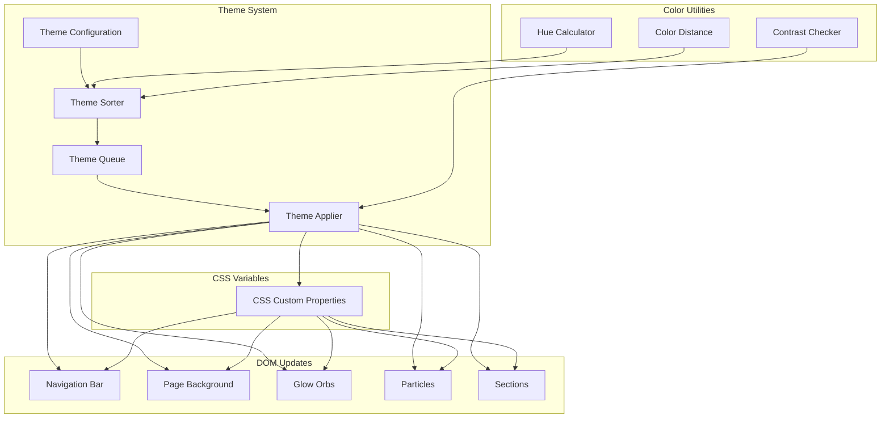
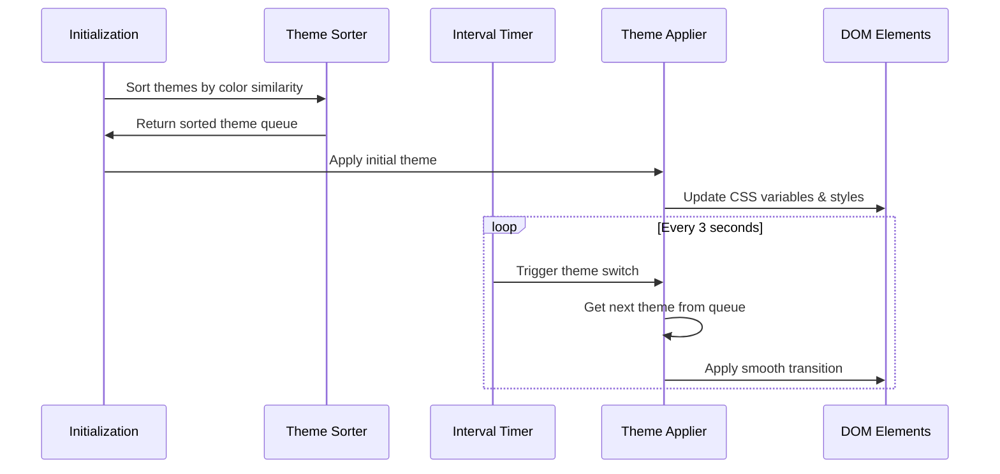

# Design Document: Gradient Theme Optimization

## Overview

本设计文档描述了个人网站主题渐变色彩优化的技术实现方案。核心目标是实现相近颜色的平滑过渡，并让导航栏和整体背景跟随主题变化，呈现每种主题独特的渐变效果。

### 设计目标

1. 按颜色相似度排序主题切换顺序，实现平滑的颜色过渡
2. 导航栏背景跟随主题变化，呈现半透明渐变效果
3. 整体页面背景使用主题专属的渐变色，不再是单一黑色基调
4. 所有视觉元素（光晕、粒子）保持与主题同步

## Architecture

### 系统架构图



### 数据流



## Components and Interfaces

### 1. Color Utility Functions

```javascript
/**
 * 将HEX颜色转换为HSL
 * @param {string} hex - HEX颜色值 (如 "#8B5CF6")
 * @returns {{h: number, s: number, l: number}} HSL值
 */
function hexToHsl(hex) {}

/**
 * 计算两个颜色之间的色相差值
 * @param {string} color1 - 第一个HEX颜色
 * @param {string} color2 - 第二个HEX颜色
 * @returns {number} 色相差值 (0-180)
 */
function getHueDifference(color1, color2) {}

/**
 * 计算两个颜色之间的对比度
 * @param {string} foreground - 前景色HEX
 * @param {string} background - 背景色HEX
 * @returns {number} 对比度比值
 */
function getContrastRatio(foreground, background) {}

/**
 * 验证对比度是否满足WCAG AA标准
 * @param {number} ratio - 对比度比值
 * @returns {boolean} 是否满足标准 (>=4.5)
 */
function meetsWcagAA(ratio) {}
```

### 2. Theme Sorter

```javascript
/**
 * 按颜色相似度排序主题数组
 * @param {Theme[]} themes - 主题配置数组
 * @returns {Theme[]} 排序后的主题数组
 */
function sortThemesByColorSimilarity(themes) {}
```

### 3. Theme Configuration Interface

```typescript
interface Theme {
  name: string;
  // 主色调
  primary: string;
  primaryLight: string;
  primaryRgb: string;
  // 辅助色
  secondary: string;
  secondaryRgb: string;
  // 强调色
  accent: string;
  accentRgb: string;
  // 主渐变
  gradient: string;
  // 光晕颜色
  glowColor1: string;
  glowColor2: string;
  glowColor3: string;
  // 背景渐变色 (新增)
  bgGradient: string;           // 整体背景渐变
  navGradient: string;          // 导航栏渐变
  sectionGradient1: string;     // 主section背景
  sectionGradient2: string;     // 次section背景
  // 背景基础色
  bgColor1: string;
  bgColor2: string;
  bgColor3: string;
}
```

### 4. Theme Applier

```javascript
/**
 * 应用主题到页面
 * @param {Theme} theme - 主题配置
 */
function applyTheme(theme) {}

/**
 * 更新导航栏样式
 * @param {Theme} theme - 主题配置
 */
function updateNavigationBar(theme) {}

/**
 * 更新页面背景
 * @param {Theme} theme - 主题配置
 */
function updatePageBackground(theme) {}

/**
 * 更新光晕和粒子
 * @param {Theme} theme - 主题配置
 */
function updateGlowAndParticles(theme) {}
```

## Data Models

### Theme Configuration Schema

```javascript
const themeSchema = {
  name: { type: 'string', required: true },
  primary: { type: 'hex-color', required: true },
  primaryLight: { type: 'hex-color', required: true },
  primaryRgb: { type: 'rgb-string', required: true },
  secondary: { type: 'hex-color', required: true },
  secondaryRgb: { type: 'rgb-string', required: true },
  accent: { type: 'hex-color', required: true },
  accentRgb: { type: 'rgb-string', required: true },
  gradient: { type: 'css-gradient', required: true },
  glowColor1: { type: 'hex-color', required: true },
  glowColor2: { type: 'hex-color', required: true },
  glowColor3: { type: 'hex-color', required: true },
  bgGradient: { type: 'css-gradient', required: true },
  navGradient: { type: 'css-gradient', required: true },
  sectionGradient1: { type: 'css-gradient', required: true },
  sectionGradient2: { type: 'css-gradient', required: true },
  bgColor1: { type: 'hex-color', required: true },
  bgColor2: { type: 'hex-color', required: true },
  bgColor3: { type: 'hex-color', required: true }
};
```

### Enhanced Theme Example

```javascript
{
  name: '梦幻紫',
  primary: '#8B5CF6',
  primaryLight: '#A78BFA',
  primaryRgb: '139, 92, 246',
  secondary: '#06B6D4',
  secondaryRgb: '6, 182, 212',
  accent: '#F472B6',
  accentRgb: '244, 114, 182',
  gradient: 'linear-gradient(135deg, #667eea 0%, #764ba2 100%)',
  glowColor1: '#8B5CF6',
  glowColor2: '#F472B6',
  glowColor3: '#06B6D4',
  // 新增渐变背景
  bgGradient: 'linear-gradient(135deg, #0F0F23 0%, #1a1a3e 50%, #2d1b4e 100%)',
  navGradient: 'linear-gradient(135deg, rgba(102, 126, 234, 0.85) 0%, rgba(118, 75, 162, 0.85) 100%)',
  sectionGradient1: 'linear-gradient(180deg, #0F0F23 0%, #1a1a3e 100%)',
  sectionGradient2: 'linear-gradient(180deg, #1A1A2E 0%, #2d1b4e 100%)',
  bgColor1: '#0F0F23',
  bgColor2: '#1A1A2E',
  bgColor3: '#16162a'
}
```

## Correctness Properties

*A property is a characteristic or behavior that should hold true across all valid executions of a system-essentially, a formal statement about what the system should do. Properties serve as the bridge between human-readable specifications and machine-verifiable correctness guarantees.*

### Property 1: Adjacent Theme Hue Difference

*For any* sorted theme queue, the hue difference between any two adjacent themes' primary colors should not exceed 60 degrees.

**Validates: Requirements 1.1**

### Property 2: Navigation Bar Transparency Range

*For any* theme configuration, when applied to the navigation bar, the background transparency should be between 0.8 and 0.9.

**Validates: Requirements 2.1**

### Property 3: Text-Background Contrast Ratio

*For any* theme configuration, the contrast ratio between navigation text color and navigation background should meet WCAG AA standard (at least 4.5:1).

**Validates: Requirements 2.3**

### Property 4: Theme Configuration Completeness

*For any* theme configuration, it should contain all required gradient properties (bgGradient, navGradient, sectionGradient1, sectionGradient2) and all color values should be valid.

**Validates: Requirements 3.1, 5.1, 5.2**

## Error Handling

### 无效颜色值处理

```javascript
function validateHexColor(color) {
  const hexRegex = /^#([A-Fa-f0-9]{6}|[A-Fa-f0-9]{3})$/;
  if (!hexRegex.test(color)) {
    console.warn(`Invalid hex color: ${color}, using fallback`);
    return '#8B5CF6'; // 默认紫色
  }
  return color;
}
```

### 主题配置验证

```javascript
function validateThemeConfig(theme) {
  const requiredFields = [
    'name', 'primary', 'primaryLight', 'primaryRgb',
    'secondary', 'secondaryRgb', 'accent', 'accentRgb',
    'gradient', 'glowColor1', 'glowColor2', 'glowColor3',
    'bgGradient', 'navGradient', 'sectionGradient1', 'sectionGradient2',
    'bgColor1', 'bgColor2', 'bgColor3'
  ];
  
  const missingFields = requiredFields.filter(field => !theme[field]);
  if (missingFields.length > 0) {
    console.error(`Theme "${theme.name}" missing fields: ${missingFields.join(', ')}`);
    return false;
  }
  return true;
}
```

## Testing Strategy

### 双重测试方法

本项目采用单元测试和属性测试相结合的方式：

- **单元测试**: 验证具体的边界情况和特定示例
- **属性测试**: 验证在所有有效输入下都应该成立的通用属性

### 属性测试框架

使用 **fast-check** 作为JavaScript的属性测试库。

### 测试配置

- 每个属性测试运行最少 **100** 次迭代
- 使用 `fc.assert` 和 `fc.property` 进行属性验证

### 属性测试示例

```javascript
// Property 1: Adjacent Theme Hue Difference
// **Feature: gradient-theme-optimization, Property 1: Adjacent Theme Hue Difference**
test('sorted themes have adjacent hue difference <= 60', () => {
  fc.assert(
    fc.property(
      fc.array(themeArbitrary, { minLength: 2, maxLength: 20 }),
      (themes) => {
        const sorted = sortThemesByColorSimilarity(themes);
        for (let i = 0; i < sorted.length - 1; i++) {
          const hueDiff = getHueDifference(sorted[i].primary, sorted[i + 1].primary);
          expect(hueDiff).toBeLessThanOrEqual(60);
        }
      }
    ),
    { numRuns: 100 }
  );
});
```

### 单元测试覆盖

1. `hexToHsl` - 颜色转换正确性
2. `getHueDifference` - 色相差计算
3. `getContrastRatio` - 对比度计算
4. `validateThemeConfig` - 配置验证
5. `sortThemesByColorSimilarity` - 排序算法

### 测试文件结构

```
tests/
├── unit/
│   └── theme-utils.test.js      # 单元测试
└── property/
    └── theme-properties.test.js  # 属性测试
```
